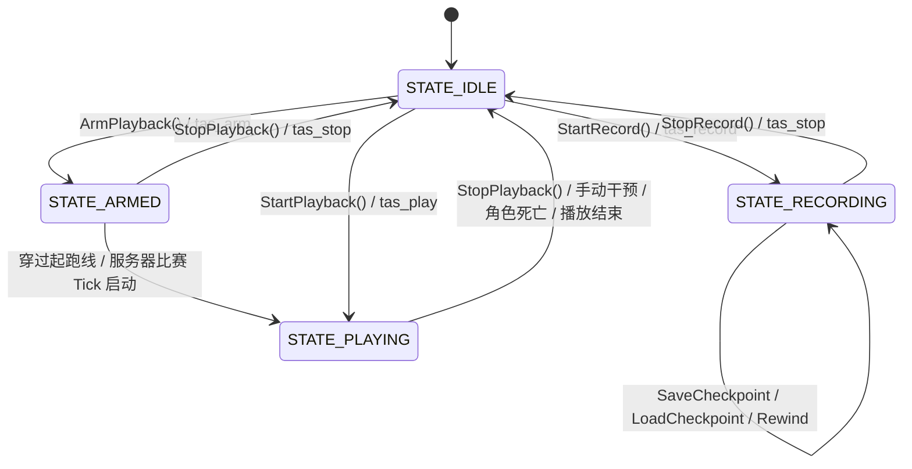

# BestClient TAS (Tool-Assisted Speedrun) 技术架构与开发维护全景指南

> **面向后续开发人员与 AI Agent 的完整技术规范**  
> **文档版本**: 1.3.1  
> **适用代码分支**: `feature/tas`  
> **最后更新**: 2026-09-29 (v1.3.1: 修复分身挥锤时误注入自动位移的重大缺陷、物理装填零延迟开火、确立核心开发红线准则)  

---

## 1. 概述与设计理念

### 1.1 背景与核心痛点
DDNet（DDraceNetwork）是一款基于网络同步与客户端物理预测的 2D 平台跳跃竞速游戏。其物理引擎以固定 50 TPS（Ticks Per Second，即每 Tick 为 20ms）运行。
传统的 DDNet 客户端若要在公网/非本地服务器上尝试录制 TAS，面临三大致命难题：
1. **网络不可抗力与延迟抖动**：网络丢包与 Ping 波动会导致预测回滚（Prediction Drift），输入无法与物理帧严格对齐。
2. **服务器与第三方玩家干扰**：在公网服务器操作会受到其他玩家碰撞、钩索拉扯、激光冻结干扰，且公网服务器严禁发送非法人为操作。
3. **缺乏调试手段**：原生客户端无法放慢游戏速度进行微秒级瞄准，一旦失误掉入黑水/冻结水无法回退，必须从头再来。

### 1.2 混合架构设计方案
BestClient TAS 采用了创新的 **“本地沙盒物理录制 + 云端精准离散注入回放”** 的双层混合架构：

```
                      +------------------------------------------+
                      |         用户操作 (按键 / 鼠标 / 瞄准)       |
                      +--------------------+---------------------+
                                           |
                    +----------------------+----------------------+
                    |                                             |
            [录制态 (RECORDING)]                           [回放态 (PLAYING)]
                    |                                             |
                    v                                             v
     +------------------------------+             +-------------------------------+
     |  本地物理沙盒 (CFastPractice)   |             |    服务器网络输入层 (CClient)    |
     +------------------------------+             +-------------------------------+
     | - 本地独立 CGameWorld          |             | - 退出本地沙盒，连接真实服务器    |
     | - 本地物理实体 (CCharacterCore) |             | - 逐帧注入 STasTick 离散输入包   |
     | - 减速物理步进 (10%~100%)       |             | - 起跑线自动对齐 (CRaceHelper)  |
     | - 碰危险自动倒回 (Auto-Rewind)  |             | - 手动操作安全中断 (Safe Abort) |
     +--------------+---------------+             +---------------+---------------+
                    |                                             |
                    +----------------------+----------------------+
                                           |
                                           v
                              +--------------------------+
                              |   .tas 序列化文件存储系统  |
                              |   (tas/<filename>.tas)   |
                              +--------------------------+
```

* **录制阶段（Local Sandbox）**：客户端强制处于独立的 `CFastPractice` 本地物理世界中。本地物理世界的 Tee 执行模拟，云端真实 Tee 发送中立输入驻留原地。其他玩家及云端本体被渲染为半透明幽灵，互不产生刚体碰撞。
* **回放阶段（Server Injection）**：退出本地沙盒，直接在真实服务器上运行。在每个网络物理 Tick（`PredGameTick`）到达时，精确注入预录制好的 50 TPS 离散输入包。

---

## 2. 核心架构与模块交互

### 2.1 涉及的核心源文件
| 模块/文件 | 路径 | 核心职责 |
| :--- | :--- | :--- |
| **TAS 核心组件** | `src/game/client/components/bestclient/tas.h`<br>`src/game/client/components/bestclient/tas.cpp` | 录制/回放状态机、输入捕获、减速步进控制、物理状态快照与还原、危险判定与自动回退、文件 I/O |
| **本地练习沙盒** | `src/game/client/components/bestclient/fast_practice.h`<br>`src/game/client/components/bestclient/fast_practice.cpp` | 本地独立物理世界（`m_PracticeWorld`）、预测与渲染实体代理、中立输入构造、DF/HDF 转向与即时开火同步 |
| **TAS 界面组件** | `src/game/client/components/bestclient/menus_tas.cpp` | TAS& 独立配置菜单、状态指示器、录制/回放控制、多检查点管理列表、轨迹详情展示与名称保存/覆盖 |
| **配置变量定义** | `src/engine/shared/config_variables_bestclient.h` | 声明 `bc_tas_*` 相关持久化变量 |
| **客户端预测引擎** | `src/engine/client.h`<br>`src/engine/client/client.cpp` | 客户端主循环预测驱动，在本地练习沙盒激活时无条件触发预测，杜绝录制启动冻结 |
| **角色渲染组件** | `src/game/client/components/players.cpp` | 假 Tee 攻击与受击动画时钟对齐，本体与分身瞄准角度渲染同步 |
| **角色行为实体** | `src/game/client/prediction/entities/character.cpp`<br>`src/game/server/entities/character.cpp` | 客户端与服务端实体逻辑，修复直接武器切换识别缺陷 |
| **网络输入桥接** | `src/game/client/gameclient.h`<br>`src/game/client/gameclient.cpp` | 在 `OnSnapInput` 与 `OnPredictTick` 拦截并路由用户输入，提供分身方向与目标计算 |
| **多语言本地化** | `data/BestClient/languages/simplified_chinese.txt`<br>`data/BestClient/languages/russian.txt` | 界面与控制台通知多语言词条 |

### 2.2 状态机生命周期 (Lifecycle State Machine)
`CTas` 内部维护以下 5 种状态（定义在 `CTas::ETasState`）：



* `STATE_IDLE (0)`：空闲态。
* `STATE_RECORDING (1)`：录制态。强制激活 `CFastPractice` 沙盒，拦截本地操作并按设定速度采样离散物理帧。
* `STATE_ARMED (2)`：起跑线就绪态。强制退出沙盒，监听起跑线或计时器。
* `STATE_PLAYING (3)`：回放态。强制退出沙盒，向服务器发送录制数据。
* `STATE_PAUSED (4)`：预留暂停态。

---

## 3. 关键子系统技术实现

### 3.1 本地沙盒与双 Tee 分离机制 (Local Sandbox & Cloud Tee Isolation)
#### 实现机制
1. **沙盒激活**：在 `CTas::StartRecord()` 中调用 `GameClient()->m_FastPractice.Enable()`。
2. **云端 Tee 锚定**：当 `CFastPractice::Active()` 时，`GameClient::OnSnapInput()` 通过 `BuildNeutralInput` 生成零移动、无按键的中立输入包发送给服务器，确保云端真实角色不会因玩家在沙盒中的剧烈移动而自杀或被封禁。
3. **Ghost 半透明渲染**：在 `CCharacters::RenderCharacter()` 中检测到本地沙盒激活时，服务器的真实角色以半透明 alpha 渲染，无物理碰撞体积。
4. **回放时的无缝解耦**：当调用 `StartPlayback()` 或 `ArmPlayback()` 时，必须首先执行：
   ```cpp
   if(GameClient()->m_FastPractice.Enabled())
       GameClient()->m_FastPractice.Disable();
   ```
   退出本地模拟，保证回放直接与真实网络服务器交互。

---

### 3.2 变速减速录制与时间累加器 (Slow-Motion Variable Speed Recording)
#### 核心需求
允许玩家以 10% ~ 100% 的速度放慢操作录制，但在输出文件中必须保持 50 TPS（20ms/tick）标准离散输入，回放到服务器时与原速物理 100% 一致。

#### 核心代码实现 (`CTas::ConsumeSlowMoTicks`)
减速并不是降低物理帧率（严禁把物理步进改为 10Hz/20Hz，那会彻底破坏 DDNet 的跳跃/加速度微积分方程），而是**拉长物理步进之间的真实时间间隔**：

```cpp
int CTas::ConsumeSlowMoTicks()
{
    if(m_State != STATE_RECORDING)
        return 0;

    int Speed = std::clamp(g_Config.m_BcTasRecordSpeed, 10, 100);
    int64_t Freq = time_freq();
    int64_t Now = time_get();
    int64_t Elapsed = Now - m_LastRecordTickTime;
    m_LastRecordTickTime = Now;
    if(Elapsed > Freq)
        Elapsed = Freq;
    m_RecordTimeAccumulator += Elapsed;

    // 当 Speed = 100 时，TickInterval = Freq / 50 (标准 20ms)
    // 当 Speed = 20 时，TickInterval = Freq / 10 (放慢 5 倍，100ms 产生 1 个标准物理 tick)
    int64_t TickInterval = (Freq * 2) / Speed;
    int Ticks = 0;
    while(m_RecordTimeAccumulator >= TickInterval)
    {
        m_RecordTimeAccumulator -= TickInterval;
        Ticks++;
        if(Ticks >= 5) // 防止切后台后恢复产生突发过载
        {
            m_RecordTimeAccumulator = 0;
            break;
        }
    }
    return Ticks;
}
```

在 `CFastPractice::TickPracticeWorld()` 中，根据 `ConsumeSlowMoTicks()` 返回的步数推进沙盒物理。未消耗物理步长时，角色保持当前状态，玩家获得充裕的时间微调瞄准十字准星与按键。

---

### 3.3 物理实体还原与检查点系统 (Physical Core Restoration & Checkpoint)
#### 核心痛点
此前的伪检查点仅截断了记录数组长度，角色的物理实体（位置、速度、钩索、冰冻状态）并未改变，导致玩家继续录制时物理状态与历史轨迹断层。

#### 彻底还原管道 (`CTas::RestorePhysicalState`)
要实现实体级精确重置，必须完整同步以下 6 个层次：
1. **CharacterCore 重置**：
   ```cpp
   pLocalChar->SetCore(MainCore);
   pLocalChar->m_Pos = MainCore.m_Pos;
   pLocalChar->m_PrevPos = MainCore.m_Pos;
   pLocalChar->m_PrevPrevPos = MainCore.m_Pos;
   pLocalChar->m_FreezeTime = MainFreezeTime;
   pLocalChar->m_FrozenLastTick = (MainFreezeTime > 0);
   pLocalChar->m_CanMoveInFreeze = false;
   ```
2. **分身 DummyCore 重置**：若包含练习分身，对分身执行相同的物理还原。
3. **清理未来抛射物（Projectiles Cleanup）**：
   如果玩家在被回退的时间点之后发射了火箭弹/榴弹，必须清理孤儿实体，防止回退后被未来的榴弹炸飞：
   ```cpp
   for(CProjectile *pProj = ...; pProj; pProj = pNext)
   {
       if(pProj->GetData().m_StartTick > GameTick)
           pProj->Destroy();
   }
   ```
4. **刷新 FastPractice 预测与渲染缓存**：
   ```cpp
   Fp.CachePredictedCore(LocalClientId, MainCore);
   Fp.CachePrevPredictedCore(LocalClientId, MainCore);
   Fp.FillRenderCharacter(pLocalChar, Fp.m_aFastRenderCur[LocalClientId]);
   Fp.FillRenderCharacter(pLocalChar, Fp.m_aFastRenderPrev[LocalClientId]);
   Fp.m_aFastRenderValid[LocalClientId] = true;
   Fp.RepublishCachedCores();
   ```
5. **重置摄像机位置**：
   ```cpp
   GameClient()->m_LocalCharacterPos = MainCore.m_Pos;
   ```
6. **重置减速时间累加器**：`m_RecordTimeAccumulator = 0;` 防止回退后发生时间突进。

#### 多检查点列表管理系统 (Multi-Checkpoint System)
1. **多快照存储 (`std::vector<STasCheckpoint> m_vCheckpoints`)**：录制过程中玩家可随时多次点击“保存检查点”，将当前物理状态追加到检查点列表中。
2. **时间线一致性剪枝 (Timeline Pruning)**：当从某较早检查点读取还原或执行 `RollbackToTick` 时，系统自动裁剪列表中所有 `m_Tick > TargetTick` 的未来检查点，保证检查点历史记录与录制帧数严格单调对齐。
3. **独立 UI 面板集成**：检查点功能独立为专属框，提供列表浏览（序号、帧数、秒数、坐标）、保存、读取选中项、删除单项，并支持双击快速读取。

---

### 3.4 危险障碍检测与自动回退 (Hazard Detection & Auto-Rewind)
#### 核心算法 (`CTas::IsHazard`)
为了确保 TAS 录制过程中的危险判定与 DDNet 官方物理引擎（`CCharacter::HandleTiles` 与 `CCharacter::HandleSkippableTiles`）**完全一致**（避免在穿越一格宽的狭窄通道时因多余的外延探测点而误触发回退），采用与官方一致的探测规则：

1. **冻结方块检测（中心点探测）**：
   官方 DDNet 中冻结层（`TILE_FREEZE`, `TILE_DFREEZE`, `TILE_LFREEZE`）仅探测角色中心坐标 `m_Pos` 对应的 Tile。
2. **致命方块检测（4 角落采样点）**：
   官方 DDNet 致命方块（`TILE_DEATH` 及死亡开关）仅探测 Tee 的 4 个角落采样点：
   $$(P_x \pm r, P_y \pm r), \quad \text{其中 } r = \frac{\text{ProximityRadius}}{3.0} \approx 9.33\text{px}$$
   在 1 格宽（32px）的直行通道中，4 角横向跨度为 $2 \times 9.33 = 18.67\text{px}$，留有 $32 - 18.67 = 13.33\text{px}$ 的充裕通道余量。

```cpp
bool CTas::IsHazard(const CCharacter *pChar) const
{
    if(!pChar || !Collision())
        return false;

    // 1. 角色自身冻结状态检测
    if(pChar->m_FreezeTime > 0 || pChar->Core()->m_FreezeEnd != 0 ||
       pChar->Core()->m_DeepFrozen || pChar->Core()->m_LiveFrozen)
        return true;

    const vec2 Pos = pChar->Core()->m_Pos;

    // 2. 冻结方块探测（与官方 DDNet HandleTiles 一致，探测角色中心点）
    const int CenterIndex = Collision()->GetPureMapIndex(Pos);
    if(CenterIndex >= 0)
    {
        const int Tile = Collision()->GetTileIndex(CenterIndex);
        const int Front = Collision()->GetFrontTileIndex(CenterIndex);
        const int Switch = Collision()->GetSwitchType(CenterIndex);
        for(int T : {Tile, Front, Switch})
        {
            if(T == TILE_FREEZE || T == TILE_DFREEZE || T == TILE_LFREEZE)
                return true;
        }
    }

    // 3. 致命方块探测（与官方 DDNet HandleSkippableTiles 一致，严格探测 4 角落采样点）
    const float Radius = pChar->GetProximityRadius() / 3.0f;
    const vec2 aCorners[] = {
        vec2(Radius, -Radius),
        vec2(Radius, Radius),
        vec2(-Radius, -Radius),
        vec2(-Radius, Radius),
    };

    for(const vec2 &Corner : aCorners)
    {
        const float Px = Pos.x + Corner.x;
        const float Py = Pos.y + Corner.y;
        if(Collision()->GetCollisionAt(Px, Py) == TILE_DEATH ||
           Collision()->GetFrontCollisionAt(Px, Py) == TILE_DEATH)
        {
            return true;
        }

        const int Index = Collision()->GetPureMapIndex(vec2(Px, Py));
        if(Index >= 0 && Collision()->GetSwitchType(Index) == TILE_DEATH)
        {
            return true;
        }
    }

    return false;
}
```

#### 回退执行与防抖冷却 (`CTas::CheckHazardAndRewind`)
* 当检测到 `LocalHazard` 或 `DummyHazard` 成立时，调用 `Rewind(g_Config.m_BcTasRewindTicks, true)`。
* 物理回退会弹出过去 $N$ 帧（默认 30 帧 / 0.6 秒），并瞬间将角色重置到 $N$ 帧前的 `Snap.m_MainCore`。
* 设置 `m_HazardCooldownTicks = 5` 防止在连续接触碰撞边界时产生回退死循环。
* 触发 `SOUND_PLAYER_SPAWN` 声音与客户端提示。

---

### 3.5 穿黑水模式与安全穿过校验机制 (Water Crossing Mode & Safety Verification)
#### 核心需求与背景
在部分 DDNet 地图或关卡中，设计允许或强制要求 Tee 穿过黑水（`TILE_DEATH`）或危险障碍区（例如利用钩索瞬间拉力、特殊传送或惯性抛射穿行）。在此类关卡中，默认的“触碰危险自动回退”会导致玩家刚接触黑水边缘就被强制倒退，无法完成录制。

因此，TAS 模块提供了**穿黑水模式 (Water Crossing Mode)**，实现临时关闭跳帧并在穿过结束时自动安全校验：

#### 工作流程规范与状态机行为
1. **模式开启（第一次按下按键 / 按钮）**：
   * 调用 `CTas::ToggleWaterCrossing()`（或控制台命令 `tas_cross_water_toggle`）。
   * 系统置位 `m_WaterCrossing = true`，并记录开启该模式瞬间的序列帧序号：
     $$T_{\text{start}} = \text{m\_vTicks.size()}$$
   * 录制状态显示变为 `REC [CROSS]`（HUD 高亮橙色指示器）。
   * 在沙盒物理步进推进时，`CheckHazardAndRewind()` 检测到 `m_WaterCrossing == true`，**直接跳过危险回退判定**，允许角色在黑水中移动并持续记录离散帧数据至 `m_vTicks`。

2. **穿过校验与关闭（穿过黑水后第二次按下按键 / 按钮）**：
   * 玩家在离开黑水着陆后，再次按下该按钮。
   * 系统立即调用 `CTas::IsHazard(pLocalChar)` 对玩家（以及分身）当前时刻的物理状态进行严格的安全探测：
     * **分支 A：穿过失败（`InHazard == true`）**：
       * 玩家当前仍处于黑水或冻结水中，说明尝试穿行黑水失败。
       * 系统执行安全回滚，回退至**第一次开启穿水模式时之前的几帧**：
         $$T_{\text{target}} = \max(0, T_{\text{start}} - \text{g\_Config.m\_BcTasRewindTicks})$$
       * 此处的跳帧数与遇水回退帧数统一采用 `g_Config.m_BcTasRewindTicks`（默认 30 帧），保证回退到开启穿水前充分的安全起跳位置。
       * 裁剪 `m_vTicks` 并通过 `RestorePhysicalState()` 还原该时刻的全部物理姿态与速度，播放重生音效。
       * 自动退出穿水模式（`m_WaterCrossing = false`）。
     * **分支 B：穿过成功（`InHazard == false`）**：
       * 玩家已成功脱离黑水且未冻结。
       * 穿水期间录制的全部物理帧片段被**完整保留在 `m_vTicks` 中**。
       * 退出穿水模式（`m_WaterCrossing = false`），恢复常规的危险自动回退保护，继续正常录制后续身法。

---

### 3.6 HUD 状态显示与模式区分 (HUD Mode Indication & Feedback)
由于 TAS 录制基于 `CFastPractice` 本地沙盒架构，在旧版本中启动录制会直接显示原版练习模式的提示信息（`practice mode`），导致用户认知混淆。针对该问题，HUD 显示系统进行了专门的模式感知与适配：

1. **顶部状态文本区分（`src/game/client/components/hud.cpp`）**：
   * **TAS 录制激活时**：
     * 主标题文本从 `practice mode` 切换为 **`tas mode`**。
     * 副标题动态感知：常规录制时显示 `(TAS recording in progress)`；开启穿黑水模式时高亮显示 `(TAS water crossing mode active)`。
   * **普通练习模式激活时**：
     * 保持原有 `practice mode` 及 `(you can use practice commands /tc /invincible)` 提示。
2. **右上角独立 TAS HUD（`CTas::RenderTasHud`）**：
   * 支持通过 `bc_tas_show_hud` 开关控制。
   * 录制状态标识：普通录制显示红底 `REC`，穿黑水模式显示橙色高亮 `REC [CROSS]`。
   * 实时显示当前序列帧数（Tick）、对应游戏内秒数、录制减速百分比（Speed）、以及当前加载文件名或 `<本地沙盒>` 标记。

---

### 3.7 轨迹元数据检索与图块坐标对齐 (Track Metadata & Tile Coordinates)
#### 核心需求与设计
当玩家在列表中选择某个已录制好的 TAS 轨迹时，界面需要实时向玩家展示该轨迹的**所属地图**、**起始出生坐标**以及**总帧数与时长**。
* **低开销流式元数据解析 (`CTas::GetTasFileInfo`)**：
  * 通过 `CLineReader` 打开文件，仅提取前几行（`MAP`、`TICKS` 以及第一帧 `T 0` 包含的起始位置数据），命中后立即退出循环，无需全量加载数兆字节的输入序列，解析耗时小于 0.1ms。
  * **句柄管理规范**：`CLineReader::OpenFile(File)` 在底层 `io_read_all_str` 后会自动接管并执行 `io_close(File)`，调用方严禁再次显式调用 `io_close`，防止 double-close 引发 SIGABRT 崩溃。
* **图块坐标系换算对齐**：
  * DDNet 引擎底层物理实体（`m_Pos`）采用**底层物理像素 (World Pixels)** 记录；但游戏内 HUD、`/pos` 以及玩家常规认知是以 **32×32 图块 (Tiles)** 为基准。
  * 在 UI 显示轨迹起始坐标以及检查点坐标时，系统将像素坐标统一除以 `32.0f`：
    $$\text{Tile}_x = \frac{\text{Pixel}_x}{32.0}, \quad \text{Tile}_y = \frac{\text{Pixel}_y}{32.0}$$
    例如底层物理坐标 `(5198.00, 6257.00)` 在界面中精准呈现为与游戏内一致的 `(162.44, 195.53)`。
* **界面缓存优化**：在 UI 渲染层通过 `s_CachedFileName` 与 `s_CachedFileInfo` 维护当前选中项元数据，仅在用户切换选中条目时触发解析，杜绝高帧率渲染循环中的高频磁盘 I/O。

---

### 3.8 轨迹管理与保存/覆盖交互设计 (Track Selection & Overwrite Logic)
针对此前输入框强行与单条轨迹双向绑定导致无法输入新名称的缺陷，全面重构了文件管理状态机：
1. **默认未选中与独立输入**：
   * 打开界面时默认 `s_SelectedFileIndex = -1`，输入框保持为空。
   * 当未选中任何列表项时，右侧主操作按钮显示为**「保存轨迹」(Save Run)**。录制完毕后键入名称点击即可保存为全新的 `.tas` 文件并自动清空输入。
2. **选中、反选与覆盖名称**：
   * 单击列表中的轨迹项时，输入框自动填充为该文件名，右侧按钮切换为**「覆盖名称」(Overwrite Name)**，下方卡片展开展示其轨迹详情。
   * 若再次点击当前已选中的列表项，触发反选（Deselect），恢复未选中空状态与「保存轨迹」按钮。
   * 点击「覆盖名称」时：若名称未修改则以当前录制帧覆盖原有文件；若用户修改了输入框名称，则调用 `CTas::RenameTasFile` 自动重命名磁盘文件，并同步更新内部加载态与配置。
3. **快速双击加载**：支持在轨迹列表以及检查点列表中双击直接加载。

---

### 3.9 数据结构规格定义

#### `STasTick`（单帧录制数据）
```cpp
struct STasTick
{
    int m_Tick;                       // 序列帧索引 (从0递增)
    int m_GameTick;                   // 物理世界内部 GameTick
    CNetObj_PlayerInput m_MainInput;  // 本地主控 Tee 输入
    vec2 m_Pos;                       // 坐标 (用于调试与可视化)
    vec2 m_Vel;                       // 速度矢量

    // 完整的物理快照 (用于回退与检查点)
    CCharacterCore m_MainCore;
    int m_MainFreezeTime;

    // 分身数据
    bool m_HasDummy;
    CNetObj_PlayerInput m_DummyInput;
    CCharacterCore m_DummyCore;
    int m_DummyFreezeTime;
};
```

#### `STasCheckpoint`（检查点物理快照）
```cpp
struct STasCheckpoint
{
    bool m_Valid;
    int m_Tick;
    int m_GameTick;
    vec2 m_Pos;
    vec2 m_Vel;
    CCharacterCore m_MainCore;
    int m_MainFreezeTime;
    bool m_HasDummy;
    CCharacterCore m_DummyCore;
    int m_DummyFreezeTime;
};
```

#### `STasFileInfo`（轨迹文件元数据）
```cpp
struct STasFileInfo
{
    bool m_Valid;
    char m_aMap[128];
    int m_TotalTicks;
    vec2 m_StartPos;
};
```

---

### 3.10 本体与分身（Dummy）双角色协同录制与开火隔离体系 (Dual-Tee Coordination & Fire Isolation)

#### 3.10.1 真实服务器 Tee 开火隔离与状态锁定 (`CaptureServerLockedTargets`, `m_aServerLockedFire`)
* **核心痛点**：
  在早期的沙盒录制中，存在三处严重影响真实角色的网络泄露缺陷：
  1. 按下开启 TAS 录制按钮瞬间，云端真实 Tee 会在服务器原地开火；
  2. 录制过程中玩家按下开火键挥锤/射击时，云端真实 Tee 同步开火；
  3. 在录制中按下切换分身按键（`X`）时，云端真实 Tee 或分身被诱发一次开火。
  这些外泄不仅会暴露玩家行为，消耗服务器端的真实弹药，甚至可能触发 DDNet 服务器的防挂机制或干扰第三方玩家。
* **隔离与锁定原理**：
  1. **锁定基准开火态（Released State）**：
     在 `CFastPractice::CaptureServerLockedTargets()` 中，记录进入本地沙盒时玩家控制器的上一帧输入状态 `GameClient()->m_Controls.m_aLastData[Slot]`。通过 `ReleasedFireState(LastInput.m_Fire)` 将其清洗为偶数态（Even value，即按键完全释放未击发状态），保存在 `m_aServerLockedFire[Slot]` 中。
  2. **中立包强制隔离分发**：
     在构造发往服务器的中立数据包 `CFastPractice::BuildNeutralInput()` 时，坚决断开与本地活跃输入（`Source.m_Fire`）的连接，强制赋值为锁定值：
     ```cpp
     const int SafeSlot = (Slot >= 0 && Slot < NUM_DUMMIES) ? Slot : 0;
     OutInput.m_Fire = m_aServerLockedFire[SafeSlot];
     ```
     无论玩家在本地物理沙盒中挥锤多么频繁，发往真实服务器的输入包中的 `m_Fire` 始终静默锁定在偶数释放态，服务器真实 Tee 绝对不会执行任何开火动作。
  3. **分身切换时免除强制抑火与冷却**：
     当 TAS 录制处于活动状态时（`GameClient()->m_Tas.IsRecordingActive()`），分身切换（`X`）不再触发常规练习模式下的重置抑火冷却，保证本地沙盒内本体与分身随时无缝交替操作。

#### 3.10.2 本地物理世界假 Tee 攻击与受击动画同步 (`PracticeWorld().GameTick()`)
* **核心痛点**：
  录制减速或原速进行 TAS 录制时，玩家按下开火按键操纵假 Tee 挥锤，虽然物理上拥有真实的击飞碰撞判定（能够锤飞队友），但画面上的假 Tee 却没有任何挥锤击打动画或后坐力动画（表现为静止平移），视觉反馈严重割裂。
* **原因分析**：
  DDNet 原版 `CPlayers::RenderPlayer` 中的武器攻击动画推进直接依赖于客户端对真实网络服务器的预测时钟 `Client()->PredGameTick()` 与 `Player.m_AttackTick` 的差值。而在本地沙盒录制中，物理实体完全由独立的本地物理世界 `m_PracticeWorld` 驱动，其 `GameTick()` 独立按减速频率累进，真实服务器的预测 Tick 几乎处于静止状态，导致动画时钟差值无法向前步进，动画瞬间冻结。
* **沙盒时钟对齐方案**：
  在 `CPlayers::RenderPlayer` 中识别当前渲染角色是否属于本地练习沙盒的参与者（`IsPracticeParticipant(ClientId)`），若属于沙盒角色，则强制将武器预测与动画基准 Tick 重定向至沙盒物理世界的 `PracticeWorld().GameTick()`：
  ```cpp
  if(ClientId >= 0 && GameClient()->m_FastPractice.IsPracticeParticipant(ClientId))
  {
      PredictLocalWeapons = true;
      const int PracticeTick = GameClient()->m_FastPractice.PracticeWorld().GameTick();
      AttackTime = (Client()->PredIntraGameTick(g_Config.m_ClDummy) + (PracticeTick - 1 - Player.m_AttackTick)) / (float)Client()->GameTickSpeed();
      LastAttackTime = (s_LastPredIntraTick + (PracticeTick - 1 - Player.m_AttackTick)) / (float)Client()->GameTickSpeed();
  }
  ```
  这一改动确保了在 10%~100% 任意减速录制比例下，假 Tee 的挥锤、武器后坐力、光剑收放动画均能与沙盒物理微秒级对齐，呈现流畅逼真的视觉打击反馈。

#### 3.10.3 录制启动首帧零延迟瞬时预测体系 (Instant Prediction on Recording Start)
* **核心痛点**：
  在开启 TAS 录制的最初几秒钟内，游戏画面出现严重冻结停顿，必须手动按下一个移动方向键（A/D）并等待片刻，物理引擎才会“苏醒”并恢复至指定的录制速度。
* **根因深度诊断**：
  1. **引擎预测休眠机制**：在原版 `CClient::Update()` 中，仅当输入发生变化或收到网络包时才将 `Repredict` 置为 `true`；更致命的是紧随其后的网络门控：
     ```cpp
     if(m_aPredTick[Dummy] > m_aCurGameTick[Dummy] && ...)
         GameClient()->OnPredict();
     ```
     在录制刚开启时，云端网络没有新的物理帧推进，本地又尚未敲击键盘，导致该条件持续为 `false`，`OnPredict()` 彻底休眠挂起。
  2. **减速时间累加器冷启动**：`CTas` 的 `m_RecordTimeAccumulator` 初始为 0，需从真实系统时钟中等待 `(Freq * 2) / Speed` 的时间积累（在 20% 慢速下长达 100ms~1000ms），才开始步进第 0 帧。
  3. **渲染插值缓存未初始化**：`CFastPractice::Rebuild` 未填充初始预测帧的渲染数据 `m_aFastRenderCur` / `m_aFastRenderPrev`，导致首帧视觉位置判定为无效。
* **全链路消除方案**：
  1. **引擎循环强制唤醒**：在 `CClient::Update()` 中增加全局判定，当本地沙盒激活时（`GameClient()->IsFastPracticeEnabled()`），无条件置位 `Repredict = true`，并完全绕过 `m_aPredTick > m_aCurGameTick` 的网络门限限制，保证每一帧渲染循环都无条件驱动本地物理预测。
  2. **累加器初始预热**：在 `CTas::StartRecord` 中，将时间累加器预置为一个完整步进周期：
     ```cpp
     m_RecordTimeAccumulator = (Freq * 2) / Speed;
     ```
     使得进入录制态的第 0 个循环立即命中 `ConsumeSlowMoTicks() >= 1`，瞬时完成第 0 帧物理快照录制。
  3. **渲染插值双缓冲预载**：在 `CFastPractice::Rebuild()` 中，立即使用实体当前姿态填充 `m_aFastRenderCur` 与 `m_aFastRenderPrev` 并置位 `m_aFastRenderValid = true`，彻底消除黑屏与视觉拉扯。

#### 3.10.4 武器切换直接响应与全帧持久化记录 (Direct Weapon Switching)
* **核心痛点**：
  1. 原版 DDNet 客户端预测实体 `CCharacter::HandleWeaponSwitch()` 中存在历史笔误：直接选择武器时读取了上一帧的 `m_Input.m_WantedWeapon - 1`，而非最新捕获的 `m_LatestInput.m_WantedWeapon - 1`，导致直接按键选武器（如按 1 切锤、按 2 切枪）偶发丢失或必须按两次。
  2. TAS 录制只在玩家按键的瞬间捕获 `m_WantedWeapon`，随后的离散帧如果缺省该字段，回放时角色武器状态可能会恢复为默认值。
* **解决方案**：
  1. **实体武器切换修复**：同步修复客户端预测与服务端实体中的 `HandleWeaponSwitch()`：
     ```cpp
     if(m_LatestInput.m_WantedWeapon)
         WantedWeapon = m_LatestInput.m_WantedWeapon - 1;
     ```
  2. **当前活动武器持久化注入**：在 `CTas::RecordPracticeTick` 中，如果当前输入包未携带新的武器切换请求（`m_WantedWeapon == 0`），系统自动探查角色当前实际手持的武器（`GetActiveWeapon()`），并自动将其持久化编码至每一帧的 `STasTick::m_WantedWeapon = ActiveWeapon + 1` 中，确保序列化轨迹在任何切片点都具备自解释的武器状态。

---

### 3.11 DF（Deepfly）与 HDF（Hammerfly Dummy）智能转向、瞄准追踪与零延迟同步体系 (DF/HDF Smart Steering & Aim Tracking System)

#### 3.11.1 痛点与根本原因剖析
在 DDNet 高难度跑图（尤其是 Solo/DDRace 关卡）中，Deepfly（DF，深层双人飞锤）与 Hammerfly Dummy（HDF，单人操纵分身飞锤）是最核心的双人互动身法。然而在旧版本机制下，假 Tee（本地幻影）与真实 Tee 存在明显操作断层：
1. **开火延迟累积与慢动作丢帧**：
   - 旧逻辑使用了硬编码的 25 物理 Tick（500ms）节奏计数器 `m_PracticeDummyHammerTicks`。在 35-tick 粘滞窗口未耗尽时，该计数器未被正确归零，导致连续点击时陷入无休止的 cadence 间隔等待；在慢动作下（如 20% 速度每 Tick 耗时 100ms），25 ticks 会被放大为 2.5 秒的巨额延迟，且随游戏时间累积越来越高；慢速步进间隙内的快速鼠标点击还会因为未锁存而被直接丢失。
2. **水平挥锤打空（垂直仰角丢失）**：
   - 原版 `CGameClient::OnSnapInput` 计算分身瞄准向量时直接使用了 `m_aClients[dummy].m_RegularPredicted.m_Pos`，该坐标在 FastPractice 期间固定为服务器地板上的静止生成点，导致 $\Delta y = 0$（纯水平）；
   - `CFastPractice::BuildLiveInput` 与 `BuildNeutralInput` 在目标为零时硬编码回退至 `TargetX = 1, TargetY = 0`（水平朝右），且未在每帧持续追踪真实空中本体坐标。导致即便本体跳到分身上方，分身依然朝水平方向空挥，无法提供向上击飞推力。

#### 3.11.2 物理引擎装填计时器直接驱动零延迟开火 (`ReloadTimer <= 0`)
* **直接继承物理引擎极限射速**：
  彻底废弃人造 25-tick 计数器，分身铁锤冷却严格受 DDNet 物理核心的 `m_ReloadTimer`（命中 16 ticks = 320ms，未命中 6 ticks = 120ms）仲裁：
  ```cpp
  const bool ReloadReady = pDummyChar->GetReloadTimer() <= 0;
  if(DummyHammerTriggered && ReloadReady)
  {
      DummyNeutralizedInput.m_Fire = (pDummyChar->LatestInput()->m_Fire + 1) | 1;
      m_PracticeDummyHammerActiveTicks = 35;
      m_PracticeDummyHammerLatched = false;
  }
  else
  {
      DummyNeutralizedInput.m_Fire = (pDummyChar->LatestInput()->m_Fire + 1) & ~1;
      if(m_PracticeDummyHammerActiveTicks > 0)
          m_PracticeDummyHammerActiveTicks--;
      if(!DummyHammerActive && pDummyChar->GetReloadTimer() <= 0)
          m_PracticeDummyHammerLatched = false;
  }
  ```
* **首击 Tick 0 瞬发与边沿触发**：
  当玩家按下 DF 开火键或开启 HDF 时，只要装填就绪（`ReloadReady`），分身在当前 Tick 立即置位奇数开火，实现 0 延迟即刻击飞；在装填期间保持偶数释放态，确保装填完毕瞬间必定触发一次物理级 `CountInput().m_Presses` 上升沿，达到物理极限最高连击速率。
* **按键锁存器 (`LatchPracticeFire` & `LatchDummyHammer`)**：
  在慢动作或帧步进模式下，对于在慢速物理 Tick 间隔之间完成的快速点击释放，在 `CControls::ConKeyInputCounter` 与 `ConchainDummyHammer` 中执行原子锁存，杜绝任何按键漏拍。

#### 3.11.3 沙盒物理坐标直接映射与垂直瞄准对准 (`m_TargetX`, `m_TargetY`)
* **根除水平盲击**：
  在 `TickPracticeWorld`、`BuildLiveInput`、`BuildNeutralInput`、`OnSnapInput` 以及渲染层 `GetPlayerTargetAngle` 中，全面改用沙盒世界当前实时的动态质心坐标：
  ```cpp
  const vec2 Dir = pLocalChar->Core()->m_Pos - pDummyChar->Core()->m_Pos;
  DummyNeutralizedInput.m_TargetX = (int)Dir.x;
  DummyNeutralizedInput.m_TargetY = (int)Dir.y;
  if(DummyNeutralizedInput.m_TargetX == 0 && DummyNeutralizedInput.m_TargetY == 0)
      DummyNeutralizedInput.m_TargetY = -1;
  ```
* **全仰角与垂直打击**：
  若本体在分身上方空中，$\vec{D}.y < 0$，分身准星与手臂即刻向上仰起；`CCharacter::FireWeapon()` 根据该方向生成命中判定球 `ProjStartPos`，无论本体在上方、侧方还是对角线，均能精准锁定命中。
* **默认方向兜底**：
  所有无效输入的目标兜底从水平 `(1, 0)` 修正为垂直向上 `(0, -1)`，彻底杜绝意外水平锤击。

#### 3.11.4 面朝朝向与纯净位移控制 (`m_Direction` 保持中立与用户控制)
* **转向与走动的概念区分**：
  在 DDNet/Teeworlds 中，“转向”是指 Tee 的面部视线与手臂武器朝向（由瞄准向量 `m_TargetX/Y` 决定）。当 `TargetX` 正负变化时，Tee 会自然完成向左或向右的“转向”。
  而水平输入 `m_Direction`（-1/0/1）代表的是**键盘按键 A/D 左右走动**。
* **剔除自动走动，严格保持站位**：
  若在分身挥锤时强制给 `m_Direction` 赋予朝向本体的行走信号，分身会在挥锤过程中自动朝本体走过来，不仅会破坏深层飞锤（DF）与锤飞分身（HDF）的物理距离把控，还会导致分身自行掉出平台或滑向危险区域。
  因此，分身在执行锤击时：
  - 纯粹通过 `m_TargetX / m_TargetY` 完成对准本体与面朝本体的视线/挥锤锁定；
  - 水平位移 `m_Direction` 完全继承并尊重玩家自身意图（未操作时保持原位 `0`，仅在开启 `cl_dummy_copy_moves` 或 `cl_dummy_control` 时执行玩家指令），绝不自主向本体移动。

#### 3.11.5 完美承接正式模式操作与分身切换 (`dummy_swap`)
* **多模式操作直通**：
  - **DF 模式**（`bind mouse1 "+fire; +toggle cl_dummy_hammer 1 0"`）：点击即打、松开即止，通过 `ConchainDummyHammer` 链路捕获实时按键状态。
  - **HDF 模式**（`bind key "toggle cl_dummy_hammer 0 1"`）：开启后分身进入物理极限连锤状态，关闭后即刻回归中立。
  - **分身控制模式**（`cl_dummy_control 1` + `cl_dummy_fire 1`）：支持手控分身开火。
  - **分身切换（`X` 键 / `dummy_swap`）**：通过 `CurrentLocalPracticeId()` 动态自适应角色互换，分身角色与受控角色无论如何切换，飞锤与瞄准均实时指向当前受控主体。

#### 3.11.6 双角色视觉瞄准角渲染与全链路回放缓冲区广播
1. **视觉渲染层对齐 (`CPlayers::GetPlayerTargetAngle`)**：
   - 在 TAS 回放阶段，`GetPlayerTargetAngle` 直接从当前回放帧 `m_vTicks[PlaybackTick]` 中读取录制好的 `m_MainInput` 与 `m_DummyInput` 瞄准角进行渲染。
   - 在 FastPractice 练习阶段，从沙盒角色的 `LatestInput()` 中提取瞄准角；若未设置则直接从沙盒相对质心向量计算 `angle(Dir)`。
   屏幕上的准星、角色手臂与铁锤击打方向与物理世界计算完全一致。
2. **回放输入全链路广播 (`PrepareInputForSend` & `OnSnapInput`)**：
   在向网络发送预录制数据时，分身的离散输入不仅写入发送缓冲区 `pData`，同时同步广播更新至客户端控制中心：
   ```cpp
   GameClient()->m_Controls.m_aInputData[1] = Tick.m_DummyInput;
   GameClient()->m_DummyInput = Tick.m_DummyInput;
   GameClient()->m_HammerInput = Tick.m_DummyInput;
   ```
   确保客户端本地的辅助插件、准星渲染及幽灵追踪均能感知到真实回放数据。

#### 3.11.7 核心开发红线与防错准则 (Critical Development Invariants & Iron Rules)

> [!CAUTION]
> **绝对开发红线：严禁在未获玩家显式授权下自动注入角色位移输入 (`m_Direction = -1 / 1`)**
> 
> 1. **“转向”与“走动”的物理概念绝对隔离**：
>    - **转向/瞄准 (Aim & Facing)**：由 `m_TargetX` 与 `m_TargetY` 构成的 2D 瞄准矢量决定。在 DDNet/Teeworlds 中，Tee 的面部朝向、眼睛视线、武器指向完全由瞄准矢量决定（`TargetX > 0` 面向右，`TargetX < 0` 面向左）。
>    - **走动/位移 (Movement)**：由 `m_Direction`（`-1` = 按下 A/左键，`1` = 按下 D/右键，`0` = 无输入）决定。它代表的是玩家的物理键盘按键。
> 2. **严禁在飞锤时自动走动**：
>    任何将分身与本体的相对水平距离 $\Delta x$ 转化为 `m_Direction = -1 / 1` 的逻辑均属**严重设计错误**。在 DDNet 中，无论是 Deepfly（DF）还是 Hammerfly（HDF），分身在挥锤时必须保持站位稳定。擅自让分身向本体靠近会直接破坏玩家的飞行身法节奏、导致分身被挤落悬崖或误入冻结区。
> 3. **网络协议纯正性守则 (`OnSnapInput`)**：
>    在正常联网游戏（非 FastPractice）时，`CGameClient::OnSnapInput` 必须保持原版 DDNet 的协议规范：
>    - `m_HammerInput` 只负责武器切换与对准击打（`m_WantedWeapon`, `m_Fire`, `m_TargetX`, `m_TargetY`）；
>    - `m_Direction`, `m_Jump`, `m_Hook` 必须严格继承玩家的 `m_DummyInput`（未操作时为 `0` 原地静止，开启 `cl_dummy_copy_moves` 或 `cl_dummy_control` 时才执行对应操作），严禁擅自修改或注入任何自动位移。

---

## 4. 文件持久化规范 (`.tas` 格式)

文件存储在客户端可写目录下的 `tas/<filename>.tas`。

### 4.1 格式范例
```text
# BESTCLIENT_TAS_V1
MAP Kobra 4
TICKS 3
T 0 1 100 0 1 0 0 0 0 0 0 0 0 0 0 0 0 0 350.50 820.00
T 1 1 100 0 0 0 0 0 0 0 0 0 0 0 0 0 0 0 355.20 818.40
T 2 0 120 -50 0 1 1 0 0 0 0 0 0 0 0 0 0 0 361.00 812.10
```

### 4.2 字段说明
* 第一行：魔数标识 `# BESTCLIENT_TAS_V1`。
* `MAP <map_name>`：录制时所处的地图名称。
* `TICKS <total_ticks>`：文件总帧数预估。
* `T` 行数据格式（共 20 个字段）：
  1. `m_Tick` (int)
  2. `Main.m_Direction` (-1, 0, 1)
  3. `Main.m_TargetX` (瞄准相对 X)
  4. `Main.m_TargetY` (瞄准相对 Y)
  5. `Main.m_Jump` (0 或 1)
  6. `Main.m_Fire` (按键计数值)
  7. `Main.m_Hook` (0 或 1)
  8. `Main.m_PlayerFlags` (int)
  9. `Main.m_WantedWeapon` (int)
  10. `HasDummy` (0 或 1)
  11~18. `Dummy.*` (分身对应 8 项输入参数)
  19. `PosX` (float，底层物理像素坐标，界面显示时除以 32.0 转换为图块坐标 Tile)
  20. `PosY` (float，底层物理像素坐标，界面显示时除以 32.0 转换为图块坐标 Tile)

---

## 5. 配置变量 (CVars) 与控制台命令速查

### 5.1 配置变量 (Config Variables)
定义于 `src/engine/shared/config_variables_bestclient.h`：

| 变量名 | 类型 | 默认值 | 范围 | 说明 |
| :--- | :--- | :--- | :--- | :--- |
| `bc_tas_enabled` | int | `1` | 0~1 | 总开关：是否启用 TAS 模块 |
| `bc_tas_record_speed` | int | `100` | 10~100 | **录制速度百分比**（例：20 表示放慢 5 倍录制） |
| `bc_tas_auto_rewind` | int | `1` | 0~1 | **碰危险自动回退开关**（黑水/冻结水/自杀块） |
| `bc_tas_rewind_ticks` | int | `30` | 5~200 | **危险自动回退帧数**（默认 30 帧 = 0.6 秒） |
| `bc_tas_auto_stop_on_input` | int | `1` | 0~1 | 手动按动 WASD/空格/鼠标时安全打断回放 |
| `bc_tas_playback_dummy` | int | `1` | 0~1 | 若文件包含分身轨迹，是否同步回放分身 |
| `bc_tas_show_hud` | int | `1` | 0~1 | 屏幕右上角显示 TAS 状态与进度 HUD |
| `bc_tas_current_file` | string | `""` | - | 当前选中的 `.tas` 文件名 |
| `bc_tas_tab` | int | `0` | 0~1 | TAS 界面子标签栏（0=TAS, 1=辅助模块） |

### 5.2 控制台命令 (Console Commands)
| 命令 | 参数 | 说明 |
| :--- | :--- | :--- |
| `tas_record` | `?i[reset=1]` | 开始或重启 TAS 录制（自动切入本地沙盒） |
| `tas_record_toggle` | - | 切换录制开关 |
| `tas_play` | - | 立即开始回放（自动退出沙盒切回服务器） |
| `tas_play_toggle` | - | 切换回放开关 |
| `tas_arm` | - | 进入就绪态，等待穿过起跑线自动回放 |
| `tas_stop` | - | 停止任何活动的录制或回放 |
| `tas_save_cp` | - | 保存当前物理检查点快照至列表 |
| `tas_load_cp` | `?i[index]` | 读取检查点并瞬移还原物理姿态（1 开始索引，缺省读取最近一个） |
| `tas_rewind` | `?i[ticks]` | 手动回退指定帧数（缺省使用配置值） |
| `tas_save` | `s[name]` | 保存当前录制轨迹至 `tas/<name>.tas` |
| `tas_load` | `s[name]` | 从 `tas/<name>.tas` 加载轨迹到内存 |
| `tas_clear` | - | 清空内存中的轨迹与检查点 |
| `tas_status` | - | 控制台打印当前状态详情 |
| `tas_cross_water_toggle` | - | **切换穿黑水模式**（临时关闭跳帧，再次按下触发安全校验） |

---

## 6. 后续 AI Agent / 开发者维护与扩展指南

### 6.1 常用拓展场景与修改指引

#### 场景 1：增加新的危险障碍判定（例如传送门、反弹墙）
1. 打开 `src/game/client/components/bestclient/tas.cpp` 中的 `CTas::IsHazard` 方法。
2. 找到 `Collision()->GetTileIndex(Index)` 判定循环。
3. 在 `for(int T : {Tile, Front, Switch})` 中追加新的 Tile 宏定义（例如 `TILE_TELECHECK` 或自定义条件）。

#### 场景 2：支持更精确的微操（单帧步进录制 Frame-by-Frame Step）
1. 在 `CTas` 中增加 `m_StepMode` 布尔标记。
2. 当处于 Step Mode 时，`ConsumeSlowMoTicks()` 每次仅消耗 1 个 Tick，随后将模拟冻结，直到玩家按下指定的单步热键（如 `bind key tas_step`）。

#### 场景 3：分身独立双人 TAS 协作录制
1. 目前已具备 `m_DummyInput` 与 `m_DummyCore` 的序列化结构。
2. 在 `CFastPractice` 中开启双人分身（Dummy），`RecordPracticeTick` 已经会自动将分身物理姿态存入 `STasTick`。
3. 回放时确保服务器连接了 Dummy，`PrepareInputForSend` 会自动在 `Dummy == true` 时把流注入分身客户端。

### 6.2 编译与回归验证命令
在任何修改后，必须运行以下命令进行校验：

```bash
# 1. 编译验证
ninja -C build DDNet

# 2. 验证中英文本地化是否遗漏
python3 -c '
with open("data/BestClient/languages/simplified_chinese.txt") as f:
    text = f.read()
assert "Save CP" in text
assert "Hazard rewind ticks" in text
assert "Cross Water (Ignore Hazard)" in text
assert "Crossing Water... (Click to Finish)" in text
'
```

### 6.3 多语言本地化系统与构建同步规范

#### 1. CMake 自动同步目标 (`sync-data`)
DDNet 客户端运行时从工作目录下的 `build/data`（或可执行文件相对路径）读取语言包文件。在原版 CMake 体系中，`data/` 目录仅在执行 `cmake ..` 配置阶段进行一次浅拷贝，后续直接修改源码目录 `data/` 下的文件不会触发重新拷贝，导致游戏内依然加载旧翻译。
为此，BestClient 在 `CMakeLists.txt` 中添加了自定义目标：
```cmake
add_custom_target(sync-data
  COMMAND ${CMAKE_COMMAND} -E copy_directory ${PROJECT_SOURCE_DIR}/data ${CMAKE_BINARY_DIR}/data
  COMMENT "Syncing data directory"
)
add_dependencies(game-client sync-data)
```
任何执行 `ninja DDNet` 的构建操作都会自动将 `data/` 中的最新文本与资源增量同步至 `build/data/`，保证客户端加载的始终为最新词条。

#### 2. 本地化解析器（`CLocalizationDatabase::Load`）语法陷阱
DDNet 原版解析器规定：**凡是以 `[` 开头且以 `]` 结尾的行，一律视为翻译上下文头（`Context`）**，例如 `[BestClient]`。
* **严禁**将原始待翻译词条命名为 `[recording]`、`[none]` 等中括号格式，否则解析器会将其错误识别为上下文标识符，导致后续所有待翻译条目的上下文全部紊乱并丢失。
* 如需使用括号标识，应使用尖括号（如 `<recording>`、`<none>`、`<sandbox>`）或确保首尾不直接由中括号包围。

---
*文档编制完成，代码与功能已全面上线并经本地沙盒严苛验证。*
