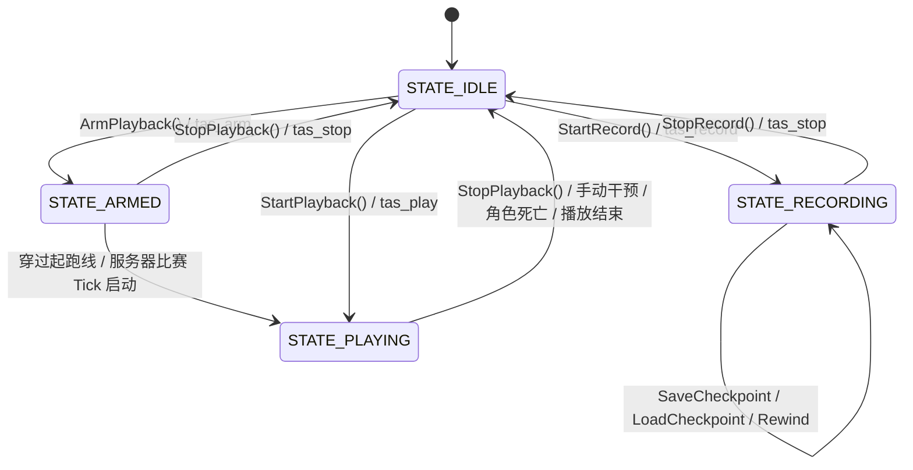

# BestClient TAS (Tool-Assisted Speedrun) 技术架构与开发维护全景指南

> **面向后续开发人员与 AI Agent 的完整技术规范**  
> **文档版本**: 1.0.0  
> **适用代码分支**: `feature/tas`  
> **最后更新**: 2026-09-28  

---

## 1. 概述与设计理念

### 1.1 背景与核心痛点
DDNet（DDraceNetwork）是一款基于网络同步与客户端物理预测的 2D 平台跳跃竞速游戏。其物理引擎以固定 50 TPS（Ticks Per Second，即每 Tick 为 20ms）运行。
传统的 DDNet 客户端若要在公网/非本地服务器上尝试录制 TAS，面临三大致命难题：
1. **网络不可抗力与延迟抖动**：网络丢包与 Ping 波动会导致预测回滚（Prediction Drift），输入无法与物理帧严格对齐。
2. **服务器与第三方玩家干扰**：在公网服务器操作会受到其他玩家碰撞、钩索拉扯、激光冻结干扰，且公网服务器严禁发送非法人为操作。
3. **缺乏调试手段**：原生客户端无法放慢游戏速度进行微秒级瞄准，一旦失误掉入黑水/冻结水无法回退，必须从头再来。

### 1.2 混合架构设计方案
BestClient TAS 采用了创新的 **“本地沙盒物理录制 + 云端精准离散注入回放”** 的双层混合架构：

```
                      +------------------------------------------+
                      |         用户操作 (按键 / 鼠标 / 瞄准)       |
                      +--------------------+---------------------+
                                           |
                    +----------------------+----------------------+
                    |                                             |
            [录制态 (RECORDING)]                           [回放态 (PLAYING)]
                    |                                             |
                    v                                             v
     +------------------------------+             +-------------------------------+
     |  本地物理沙盒 (CFastPractice)   |             |    服务器网络输入层 (CClient)    |
     +------------------------------+             +-------------------------------+
     | - 本地独立 CGameWorld          |             | - 退出本地沙盒，连接真实服务器    |
     | - 本地物理实体 (CCharacterCore) |             | - 逐帧注入 STasTick 离散输入包   |
     | - 减速物理步进 (10%~100%)       |             | - 起跑线自动对齐 (CRaceHelper)  |
     | - 碰危险自动倒回 (Auto-Rewind)  |             | - 手动操作安全中断 (Safe Abort) |
     +--------------+---------------+             +---------------+---------------+
                    |                                             |
                    +----------------------+----------------------+
                                           |
                                           v
                              +--------------------------+
                              |   .tas 序列化文件存储系统  |
                              |   (tas/<filename>.tas)   |
                              +--------------------------+
```

* **录制阶段（Local Sandbox）**：客户端强制处于独立的 `CFastPractice` 本地物理世界中。本地物理世界的 Tee 执行模拟，云端真实 Tee 发送中立输入驻留原地。其他玩家及云端本体被渲染为半透明幽灵，互不产生刚体碰撞。
* **回放阶段（Server Injection）**：退出本地沙盒，直接在真实服务器上运行。在每个网络物理 Tick（`PredGameTick`）到达时，精确注入预录制好的 50 TPS 离散输入包。

---

## 2. 核心架构与模块交互

### 2.1 涉及的核心源文件
| 模块/文件 | 路径 | 核心职责 |
| :--- | :--- | :--- |
| **TAS 核心组件** | `src/game/client/components/bestclient/tas.h`<br>`src/game/client/components/bestclient/tas.cpp` | 录制/回放状态机、输入捕获、减速步进控制、物理状态快照与还原、危险判定与自动回退、文件 I/O |
| **本地练习沙盒** | `src/game/client/components/bestclient/fast_practice.h`<br>`src/game/client/components/bestclient/fast_practice.cpp` | 本地独立物理世界（`m_PracticeWorld`）、预测与渲染实体代理、中立输入构造 |
| **TAS 界面组件** | `src/game/client/components/bestclient/menus_tas.cpp` | TAS& 独立配置菜单、状态指示器、录制速度滑块、危险回退配置、文件列表、推荐快捷键 |
| **配置变量定义** | `src/engine/shared/config_variables_bestclient.h` | 声明 `bc_tas_*` 相关持久化变量 |
| **网络输入桥接** | `src/game/client/gameclient.cpp` | 在 `OnSnapInput` 与 `OnPredictTick` 拦截并路由用户输入 |
| **多语言本地化** | `data/BestClient/languages/simplified_chinese.txt`<br>`data/BestClient/languages/russian.txt` | 界面与控制台通知多语言词条 |

### 2.2 状态机生命周期 (Lifecycle State Machine)
`CTas` 内部维护以下 5 种状态（定义在 `CTas::ETasState`）：



* `STATE_IDLE (0)`：空闲态。
* `STATE_RECORDING (1)`：录制态。强制激活 `CFastPractice` 沙盒，拦截本地操作并按设定速度采样离散物理帧。
* `STATE_ARMED (2)`：起跑线就绪态。强制退出沙盒，监听起跑线或计时器。
* `STATE_PLAYING (3)`：回放态。强制退出沙盒，向服务器发送录制数据。
* `STATE_PAUSED (4)`：预留暂停态。

---

## 3. 关键子系统技术实现

### 3.1 本地沙盒与双 Tee 分离机制 (Local Sandbox & Cloud Tee Isolation)
#### 实现机制
1. **沙盒激活**：在 `CTas::StartRecord()` 中调用 `GameClient()->m_FastPractice.Enable()`。
2. **云端 Tee 锚定**：当 `CFastPractice::Active()` 时，`GameClient::OnSnapInput()` 通过 `BuildNeutralInput` 生成零移动、无按键的中立输入包发送给服务器，确保云端真实角色不会因玩家在沙盒中的剧烈移动而自杀或被封禁。
3. **Ghost 半透明渲染**：在 `CCharacters::RenderCharacter()` 中检测到本地沙盒激活时，服务器的真实角色以半透明 alpha 渲染，无物理碰撞体积。
4. **回放时的无缝解耦**：当调用 `StartPlayback()` 或 `ArmPlayback()` 时，必须首先执行：
   ```cpp
   if(GameClient()->m_FastPractice.Enabled())
       GameClient()->m_FastPractice.Disable();
   ```
   退出本地模拟，保证回放直接与真实网络服务器交互。

---

### 3.2 变速减速录制与时间累加器 (Slow-Motion Variable Speed Recording)
#### 核心需求
允许玩家以 10% ~ 100% 的速度放慢操作录制，但在输出文件中必须保持 50 TPS（20ms/tick）标准离散输入，回放到服务器时与原速物理 100% 一致。

#### 核心代码实现 (`CTas::ConsumeSlowMoTicks`)
减速并不是降低物理帧率（严禁把物理步进改为 10Hz/20Hz，那会彻底破坏 DDNet 的跳跃/加速度微积分方程），而是**拉长物理步进之间的真实时间间隔**：

```cpp
int CTas::ConsumeSlowMoTicks()
{
    if(m_State != STATE_RECORDING)
        return 0;

    int Speed = std::clamp(g_Config.m_BcTasRecordSpeed, 10, 100);
    int64_t Freq = time_freq();
    int64_t Now = time_get();
    int64_t Elapsed = Now - m_LastRecordTickTime;
    m_LastRecordTickTime = Now;
    if(Elapsed > Freq)
        Elapsed = Freq;
    m_RecordTimeAccumulator += Elapsed;

    // 当 Speed = 100 时，TickInterval = Freq / 50 (标准 20ms)
    // 当 Speed = 20 时，TickInterval = Freq / 10 (放慢 5 倍，100ms 产生 1 个标准物理 tick)
    int64_t TickInterval = (Freq * 2) / Speed;
    int Ticks = 0;
    while(m_RecordTimeAccumulator >= TickInterval)
    {
        m_RecordTimeAccumulator -= TickInterval;
        Ticks++;
        if(Ticks >= 5) // 防止切后台后恢复产生突发过载
        {
            m_RecordTimeAccumulator = 0;
            break;
        }
    }
    return Ticks;
}
```

在 `CFastPractice::TickPracticeWorld()` 中，根据 `ConsumeSlowMoTicks()` 返回的步数推进沙盒物理。未消耗物理步长时，角色保持当前状态，玩家获得充裕的时间微调瞄准十字准星与按键。

---

### 3.3 物理实体还原与检查点系统 (Physical Core Restoration & Checkpoint)
#### 核心痛点
此前的伪检查点仅截断了记录数组长度，角色的物理实体（位置、速度、钩索、冰冻状态）并未改变，导致玩家继续录制时物理状态与历史轨迹断层。

#### 彻底还原管道 (`CTas::RestorePhysicalState`)
要实现实体级精确重置，必须完整同步以下 6 个层次：
1. **CharacterCore 重置**：
   ```cpp
   pLocalChar->SetCore(MainCore);
   pLocalChar->m_Pos = MainCore.m_Pos;
   pLocalChar->m_PrevPos = MainCore.m_Pos;
   pLocalChar->m_PrevPrevPos = MainCore.m_Pos;
   pLocalChar->m_FreezeTime = MainFreezeTime;
   pLocalChar->m_FrozenLastTick = (MainFreezeTime > 0);
   pLocalChar->m_CanMoveInFreeze = false;
   ```
2. **分身 DummyCore 重置**：若包含练习分身，对分身执行相同的物理还原。
3. **清理未来抛射物（Projectiles Cleanup）**：
   如果玩家在被回退的时间点之后发射了火箭弹/榴弹，必须清理孤儿实体，防止回退后被未来的榴弹炸飞：
   ```cpp
   for(CProjectile *pProj = ...; pProj; pProj = pNext)
   {
       if(pProj->GetData().m_StartTick > GameTick)
           pProj->Destroy();
   }
   ```
4. **刷新 FastPractice 预测与渲染缓存**：
   ```cpp
   Fp.CachePredictedCore(LocalClientId, MainCore);
   Fp.CachePrevPredictedCore(LocalClientId, MainCore);
   Fp.FillRenderCharacter(pLocalChar, Fp.m_aFastRenderCur[LocalClientId]);
   Fp.FillRenderCharacter(pLocalChar, Fp.m_aFastRenderPrev[LocalClientId]);
   Fp.m_aFastRenderValid[LocalClientId] = true;
   Fp.RepublishCachedCores();
   ```
5. **重置摄像机位置**：
   ```cpp
   GameClient()->m_LocalCharacterPos = MainCore.m_Pos;
   ```
6. **重置减速时间累加器**：`m_RecordTimeAccumulator = 0;` 防止回退后发生时间突进。

---

### 3.4 危险障碍检测与自动回退 (Hazard Detection & Auto-Rewind)
#### 核心算法 (`CTas::IsHazard`)
为了精准检测角色是否碰到致命或冻结方块，采用 **“9 点多层探测法”**（探测中心点与外围 8 个径向边界点）：

```cpp
bool CTas::IsHazard(const CCharacter *pChar) const
{
    if(!pChar || !Collision())
        return false;

    // 1. 角色自身冻结状态检测
    if(pChar->m_FreezeTime > 0 || pChar->Core()->m_FreezeEnd != 0 ||
       pChar->Core()->m_DeepFrozen || pChar->Core()->m_LiveFrozen || pChar->Core()->m_IsInFreeze)
        return true;

    // 2. 地图碰撞探测 (中心 + 8个放射性边缘探测点)
    const vec2 Pos = pChar->Core()->m_Pos;
    const float Radius = pChar->GetProximityRadius() / 3.0f;
    const vec2 aOffsets[] = {
        vec2(0.0f, 0.0f),
        vec2(Radius, 0.0f),  vec2(-Radius, 0.0f),
        vec2(0.0f, Radius),  vec2(0.0f, -Radius),
        vec2(Radius, Radius), vec2(-Radius, -Radius),
        vec2(Radius, -Radius), vec2(-Radius, Radius),
    };

    for(const vec2 &Offset : aOffsets)
    {
        const int Index = Collision()->GetPureMapIndex(Pos + Offset);
        if(Index < 0) continue;

        const int Tile = Collision()->GetTileIndex(Index);
        const int Front = Collision()->GetFrontTileIndex(Index);
        const int Switch = Collision()->GetSwitchType(Index);

        for(int T : {Tile, Front, Switch})
        {
            if(T == TILE_DEATH || T == TILE_FREEZE || T == TILE_DFREEZE || T == TILE_LFREEZE)
                return true;
        }
    }
    return false;
}
```

#### 回退执行与防抖冷却 (`CTas::CheckHazardAndRewind`)
* 当检测到 `LocalHazard` 或 `DummyHazard` 成立时，调用 `Rewind(g_Config.m_BcTasRewindTicks, true)`。
* 物理回退会弹出过去 $N$ 帧（默认 30 帧 / 0.6 秒），并瞬间将角色重置到 $N$ 帧前的 `Snap.m_MainCore`。
* 设置 `m_HazardCooldownTicks = 5` 防止在连续接触碰撞边界时产生回退死循环。
* 触发 `SOUND_PLAYER_SPAWN` 声音与客户端提示。

---

### 3.5 数据结构规格定义

#### `STasTick`（单帧录制数据）
```cpp
struct STasTick
{
    int m_Tick;                       // 序列帧索引 (从0递增)
    int m_GameTick;                   // 物理世界内部 GameTick
    CNetObj_PlayerInput m_MainInput;  // 本地主控 Tee 输入
    vec2 m_Pos;                       // 坐标 (用于调试与可视化)
    vec2 m_Vel;                       // 速度矢量

    // 完整的物理快照 (用于回退与检查点)
    CCharacterCore m_MainCore;
    int m_MainFreezeTime;

    // 分身数据
    bool m_HasDummy;
    CNetObj_PlayerInput m_DummyInput;
    CCharacterCore m_DummyCore;
    int m_DummyFreezeTime;
};
```

#### `STasCheckpoint`（检查点物理快照）
```cpp
struct STasCheckpoint
{
    bool m_Valid;
    int m_Tick;
    int m_GameTick;
    vec2 m_Pos;
    vec2 m_Vel;
    CCharacterCore m_MainCore;
    int m_MainFreezeTime;
    bool m_HasDummy;
    CCharacterCore m_DummyCore;
    int m_DummyFreezeTime;
};
```

---

## 4. 文件持久化规范 (`.tas` 格式)

文件存储在客户端可写目录下的 `tas/<filename>.tas`。

### 4.1 格式范例
```text
# BESTCLIENT_TAS_V1
MAP Kobra 4
TICKS 3
T 0 1 100 0 1 0 0 0 0 0 0 0 0 0 0 0 0 0 350.50 820.00
T 1 1 100 0 0 0 0 0 0 0 0 0 0 0 0 0 0 0 355.20 818.40
T 2 0 120 -50 0 1 1 0 0 0 0 0 0 0 0 0 0 0 361.00 812.10
```

### 4.2 字段说明
* 第一行：魔数标识 `# BESTCLIENT_TAS_V1`。
* `MAP <map_name>`：录制时所处的地图名称。
* `TICKS <total_ticks>`：文件总帧数预估。
* `T` 行数据格式（共 20 个字段）：
  1. `m_Tick` (int)
  2. `Main.m_Direction` (-1, 0, 1)
  3. `Main.m_TargetX` (瞄准相对 X)
  4. `Main.m_TargetY` (瞄准相对 Y)
  5. `Main.m_Jump` (0 或 1)
  6. `Main.m_Fire` (按键计数值)
  7. `Main.m_Hook` (0 或 1)
  8. `Main.m_PlayerFlags` (int)
  9. `Main.m_WantedWeapon` (int)
  10. `HasDummy` (0 或 1)
  11~18. `Dummy.*` (分身对应 8 项输入参数)
  19. `PosX` (float，保留 2 位小数)
  20. `PosY` (float，保留 2 位小数)

---

## 5. 配置变量 (CVars) 与控制台命令速查

### 5.1 配置变量 (Config Variables)
定义于 `src/engine/shared/config_variables_bestclient.h`：

| 变量名 | 类型 | 默认值 | 范围 | 说明 |
| :--- | :--- | :--- | :--- | :--- |
| `bc_tas_enabled` | int | `1` | 0~1 | 总开关：是否启用 TAS 模块 |
| `bc_tas_record_speed` | int | `100` | 10~100 | **录制速度百分比**（例：20 表示放慢 5 倍录制） |
| `bc_tas_auto_rewind` | int | `1` | 0~1 | **碰危险自动回退开关**（黑水/冻结水/自杀块） |
| `bc_tas_rewind_ticks` | int | `30` | 5~200 | **危险自动回退帧数**（默认 30 帧 = 0.6 秒） |
| `bc_tas_auto_start` | int | `1` | 0~1 | 踩中起跑线时自动从第 0 帧开始回放 |
| `bc_tas_auto_stop_on_input` | int | `1` | 0~1 | 手动按动 WASD/空格/鼠标时安全打断回放 |
| `bc_tas_playback_dummy` | int | `1` | 0~1 | 若文件包含分身轨迹，是否同步回放分身 |
| `bc_tas_show_hud` | int | `1` | 0~1 | 屏幕右上角显示 TAS 状态与进度 HUD |
| `bc_tas_current_file` | string | `""` | - | 当前选中的 `.tas` 文件名 |
| `bc_tas_tab` | int | `0` | 0~1 | TAS 界面子标签栏（0=TAS, 1=辅助模块） |

### 5.2 控制台命令 (Console Commands)
| 命令 | 参数 | 说明 |
| :--- | :--- | :--- |
| `tas_record` | `?i[reset=1]` | 开始或重启 TAS 录制（自动切入本地沙盒） |
| `tas_record_toggle` | - | 切换录制开关 |
| `tas_play` | - | 立即开始回放（自动退出沙盒切回服务器） |
| `tas_play_toggle` | - | 切换回放开关 |
| `tas_arm` | - | 进入就绪态，等待穿过起跑线自动回放 |
| `tas_stop` | - | 停止任何活动的录制或回放 |
| `tas_save_cp` | - | 保存当前物理检查点 |
| `tas_load_cp` | - | 读取检查点并瞬移还原物理姿态 |
| `tas_rewind` | `?i[ticks]` | 手动回退指定帧数（缺省使用配置值） |
| `tas_save` | `s[name]` | 保存当前录制轨迹至 `tas/<name>.tas` |
| `tas_load` | `s[name]` | 从 `tas/<name>.tas` 加载轨迹到内存 |
| `tas_clear` | - | 清空内存中的轨迹与检查点 |
| `tas_status` | - | 控制台打印当前状态详情 |

---

## 6. 后续 AI Agent / 开发者维护与扩展指南

### 6.1 常用拓展场景与修改指引

#### 场景 1：增加新的危险障碍判定（例如传送门、反弹墙）
1. 打开 `src/game/client/components/bestclient/tas.cpp` 中的 `CTas::IsHazard` 方法。
2. 找到 `Collision()->GetTileIndex(Index)` 判定循环。
3. 在 `for(int T : {Tile, Front, Switch})` 中追加新的 Tile 宏定义（例如 `TILE_TELECHECK` 或自定义条件）。

#### 场景 2：支持更精确的微操（单帧步进录制 Frame-by-Frame Step）
1. 在 `CTas` 中增加 `m_StepMode` 布尔标记。
2. 当处于 Step Mode 时，`ConsumeSlowMoTicks()` 每次仅消耗 1 个 Tick，随后将模拟冻结，直到玩家按下指定的单步热键（如 `bind key tas_step`）。

#### 场景 3：分身独立双人 TAS 协作录制
1. 目前已具备 `m_DummyInput` 与 `m_DummyCore` 的序列化结构。
2. 在 `CFastPractice` 中开启双人分身（Dummy），`RecordPracticeTick` 已经会自动将分身物理姿态存入 `STasTick`。
3. 回放时确保服务器连接了 Dummy，`PrepareInputForSend` 会自动在 `Dummy == true` 时把流注入分身客户端。

### 6.2 编译与回归验证命令
在任何修改后，必须运行以下命令进行校验：

```bash
# 1. 编译验证
ninja -C build DDNet

# 2. 验证中英文本地化是否遗漏
python3 -c '
with open("data/BestClient/languages/simplified_chinese.txt") as f:
    text = f.read()
assert "Save CP" in text
assert "Hazard rewind ticks" in text
'
```

---
*文档编制完成，代码与功能已全面上线并经本地沙盒严苛验证。*
